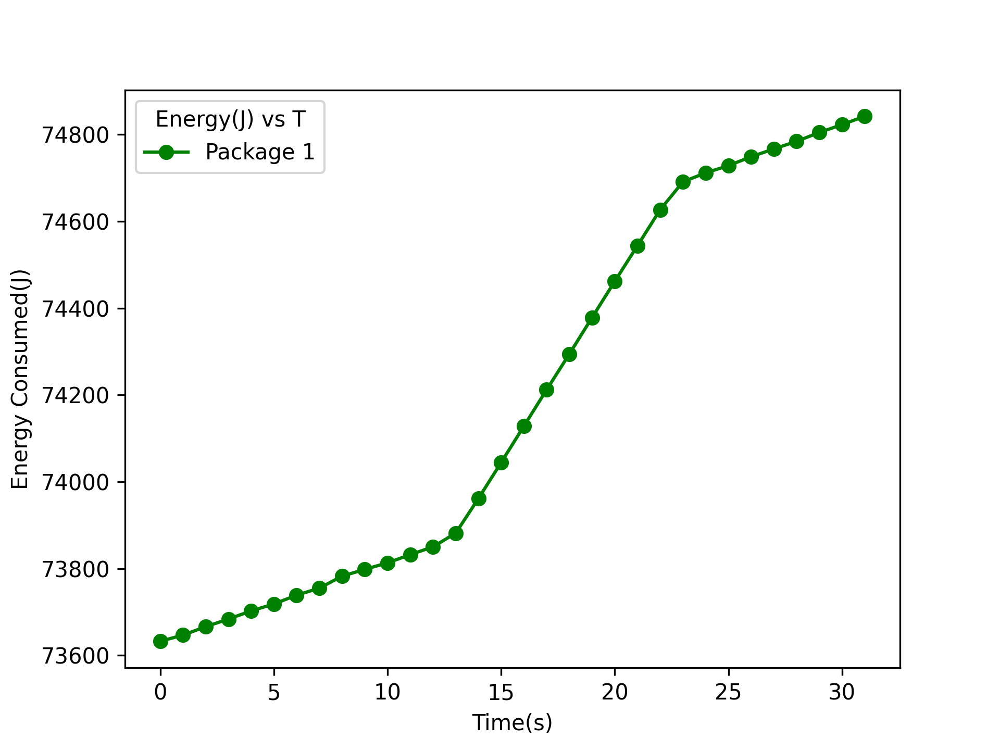
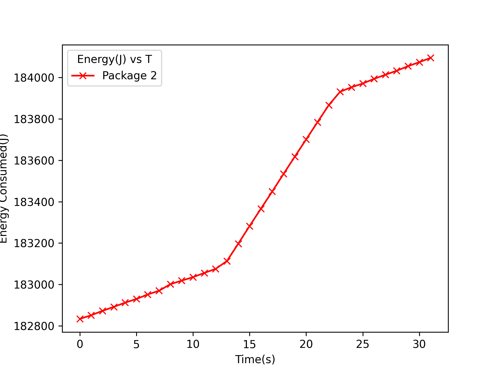
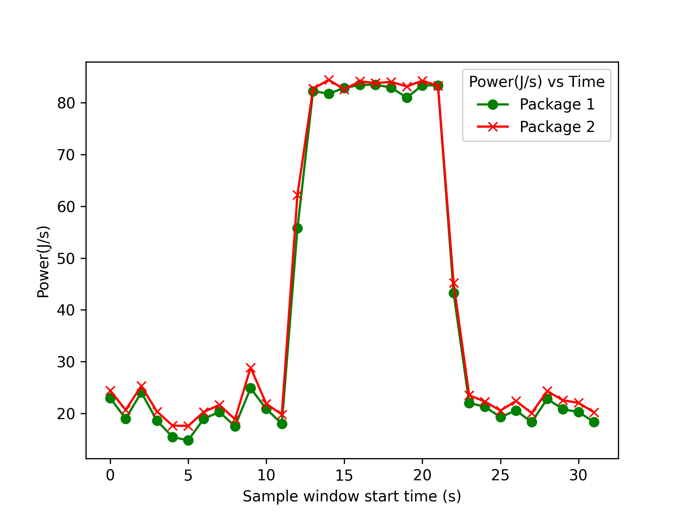
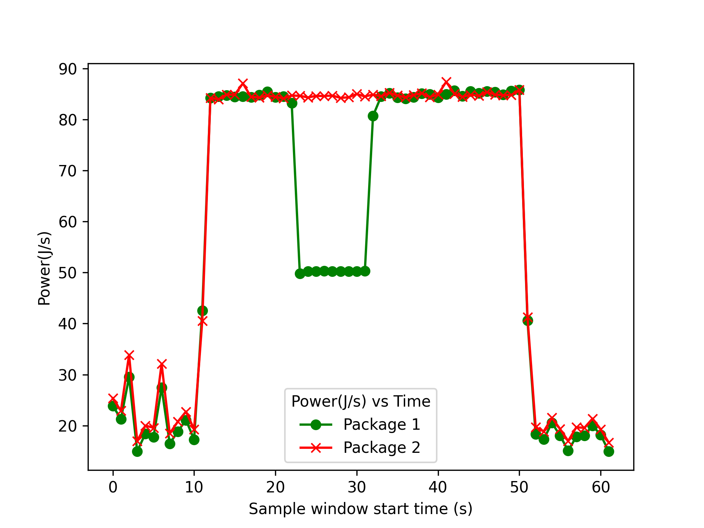

# Power Consumption of Heterogeneous Clusters

Chameleon Cloud is a large-scale, deeply reconfigurable experimental platform built to support Computer Sciences systems research. It hosts baremetal nodes
with many configurations and also gives users full control of the software stack including root privileges, kernel customization, and console access.

## Chameleon's Heterogeneity

Chameleon supports x86_64 (Intel) and aarch64 (Cavium, QLogic, Fujitsu) CPU architectures as well as Nvidia and AMD GPUs.
Specific model information can be found in Chameleon's [Hardware Discovery](https://chameleoncloud.org/hardware/).

Note: Does not support AMD CPUs but can be added to CHI@EVL site of Chameleon Cloud.


## Power consumption and capping

Various units of a heterogenous system might have differnt ways of accessing power and energy readings. For example, Intel processors after and including Sandy Bridge provides the RAPL (Running Average Power Limit) interface via the linux kernel under `/sys/devices/virtual/powercap/intel-rapl`. For GPUs, Nvidia provides nvidia-smi (System Management Interface). These tools allow power mangement by interacting with the model specific registers (MSRs). 

**Chameleon provides root access which allows us to use tools and read necessary files such as the intel-rapl files in the Kernel's `\sys` interface.**

|||
|-----------|-----------|
|Intel CPUs post Sandybridge Architecture| [Intel RAPL](https://www.intel.com/content/www/us/en/developer/articles/technical/software-security-guidance/advisory-guidance/running-average-power-limit-energy-reporting.html), [Kernel docs](https://www.kernel.org/doc/html/next/power/powercap/powercap.html)|
|Nvidia GPUs post 2011|[nvidia smi](https://developer.download.nvidia.com/compute/DCGM/docs/nvidia-smi-367.38.pdf)|
|arm| [ACPI](https://developer.arm.com/Architectures/ACPI) (Unsure about this ???)|
|AMD Family 17h, 19h|RAPL (same register contents, but the MSR numbers are different), [17h support Kernel Patch](https://git.kernel.org/pub/scm/linux/kernel/git/rafael/linux-pm.git/commit/?h=linux-next&id=43756a298928c9a4e8201baaeb205c0c103728af), [19h support Kernel Patch](https://git.kernel.org/pub/scm/linux/kernel/git/rafael/linux-pm.git/commit/?h=linux-next&id=8a9d881f22d7a0e06a46a326d0880fb45a06d3b5)|
|AMD GPUs| ??? |
|FPGAs|???|

A more comprehensive list can be found in this [article](https://web.eece.maine.edu/~vweaver/projects/perf_events/uncore/offcore_uncore.pdf).


## On Chameleon ~ Experiment on Intel Skylake using RAPL on Chameleon Cloud


### Power monitoring
This exeperiment demonstrates energy monitoring an Intel Skylake CPU using RAPL on Chameleon Cloud.  

```
# cpuifo
Architecture:          x86_64
CPU(s):                48
Thread(s) per core:    2
Core(s) per socket:    12
Model name:            Intel(R) Xeon(R) Gold 6126 CPU @ 2.60GHz
```
This node was leased at the CHI@TACC site and the CPU contains 2 physical packages PP0 and PP1.

The energy consumption can be understood by reading files for each package. For package 0 read the files:
* `/sys/class/powercap/intel-rapl/intel-rapl:0/energy_uj`
* `/sys/class/powercap/intel-rapl/intel-rapl:0/max_energy_uj`

and for package N:
* `/sys/class/powercap/intel-rapl/intel-rapl:{N}/energy_uj`
* `/sys/class/powercap/intel-rapl/intel-rapl:{N}/max_energy_uj`

`energy_uj` keeps a counter of energy consumed in micro joules and when this counter reaches the value of `max_energy_uj`, it is reset to 0.

The below energy plots were produced by querying the files for a 30s window while a 10s stress test was run the 32 cores.





The power plots were created by sampling for a window of 1s:



### Power capping

Power capping can be performed by writing to the following files:
* Long term constraint - Package 0: `/sys/class/powercap/intel-rapl/intel-rapl:0/constraint_0_power_limit_uw`
* Short term constraint - Package 1: `/sys/class/powercap/intel-rapl/intel-rapl:0/constraint_1_power_limit_uw`
* Long term constraint - Package 0: `/sys/class/powercap/intel-rapl/intel-rapl:1/constraint_0_power_limit_uw`
* Short term constraint - Package 1: `/sys/class/powercap/intel-rapl/intel-rapl:1/constraint_1_power_limit_uw`

Each of these files is accompanied by the time_window after which the constraint can be reevaluated.
For eg: `/sys/class/powercap/intel-rapl/intel-rapl:0/constraint_0_time_window_us` for Long term constraint of Package 0.

You may also find the name of the constraint inside `constraint_0_name`  
```
[cc@skylake powerman]$ cat /sys/class/powercap/intel-rapl/intel-rapl:0/constraint_0_name
long_term
```

Below plot shows a 50W cap applied to package 0 while performing a stress test:


## Chameleon reserving resources
Chameleon resources are available at multiple sites, e.g., CHI@TACC, CHI@UC, CHI@Edge. Each of the sites host their own resources for each project to use. It is possible to lease resources at each chameleon site. The maximum length of a lease is 7 days. You can find more details about reservations [here](https://chameleoncloud.readthedocs.io/en/latest/technical/reservations.html).

Once a reservation is obtained for a device, a bare metal instance can be launched with various options of images such as Ubuntu, CentOS, etc. More on launching instances and setting up ssh access can be found [here](https://chameleoncloud.readthedocs.io/en/latest/technical/baremetal.html).


## References

### Links
* https://web.eece.maine.edu/~vweaver/projects/rapl/rapl_support.html
* https://ark.intel.com/content/www/us/en/ark/products/120483/intel-xeon-gold-6126-processor-19-25m-cache-2-60-ghz.html
* https://www.intel.com/content/www/us/en/developer/articles/technical/software-security-guidance/advisory-guidance/running-average-power-limit-energy-reporting.html
* https://vstinner.github.io/intel-cpus.html#:~:text=The%20processor%20P%2Dstate%20is,some%20penalty%20to%20CPU%20performance.
* https://www.youtube.com/watch?v=1Rl8PyuK6yA
* https://www.reddit.com/r/Fedora/comments/11lh9nn/set_nvidia_gpu_power_and_temp_limit_on_boot/
* https://developer.nvidia.com/nvidia-management-library-nvml
* https://forums.developer.nvidia.com/t/nvidia-smi-query-gpu-power-draw-can-this-be-used-to-detect-if-the-gpu-is-working/118335
* https://developer.download.nvidia.com/compute/DCGM/docs/nvidia-smi-367.38.pdf
* https://developer.arm.com/Architectures/ACPI

### Papers
* https://dl.acm.org/doi/10.1145/2989081.2989088
* https://ieeexplore.ieee.org/document/9139675
* https://ieeexplore.ieee.org/document/6557170
* https://docs.kernel.org/power/apm-acpi.html

### Articles
* https://web.eece.maine.edu/~vweaver/projects/perf_events/uncore/offcore_uncore.pdf

